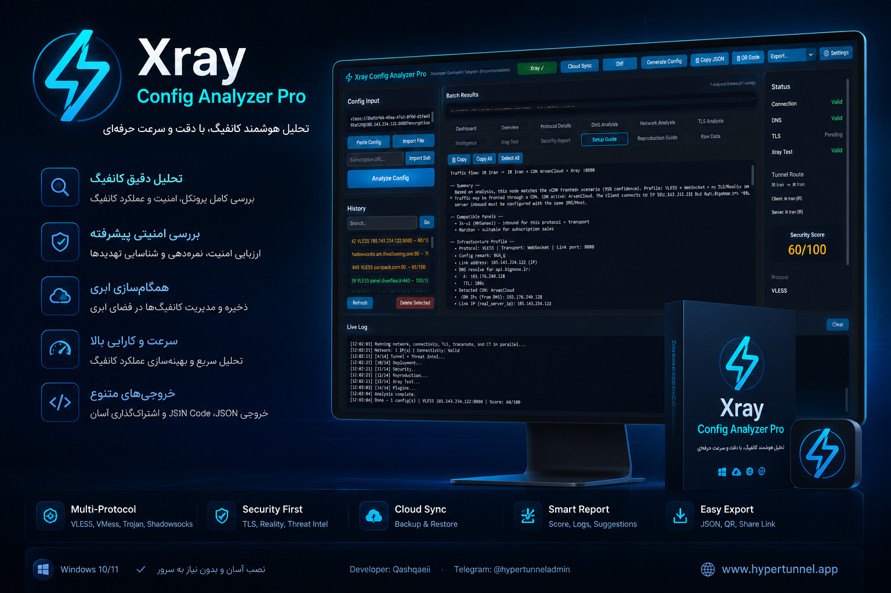

<p align="center">
  
</p>

<h1 align="center">Xray Config Analyzer Pro</h1>

<p align="center">
  <strong>تحلیل هوشمند کانفیگ · Smart Xray/V2Ray Config Analysis</strong>
</p>

<p align="center">
  <a href="#english">English</a> · <a href="#فارسی">فارسی</a> ·
  <a href="release/XrayConfigAnalyzerPro-Windows-x64.zip">Windows Download (ZIP)</a>
</p>

<p align="center">
  
  
  
  
</p>

<p align="center">
  <b>Developer:</b> Qashqaeii ·
  <b>Telegram:</b> <a href="https://t.me/Hypertunneladmin">@Hypertunneladmin</a> ·
  <b>Web:</b> <a href="https://www.hypertunnel.app">hypertunnel.app</a>
</p>

---

## English

<a id="english"></a>

### Overview

**Xray Config Analyzer Pro** is a professional desktop tool for deep analysis of Xray/V2Ray proxy configurations. Paste a share link, import JSON, or load a subscription — the app runs DNS, network, TLS, security, deployment, and live Xray tests in a modern GUI.

### Highlights

| Area | Capabilities |
|------|----------------|
| **Protocols** | VLESS, VMess, Trojan, Shadowsocks, Hysteria2, TUIC, WireGuard, OpenVPN |
| **Analysis** | DNS (A/AAAA/CNAME), ASN/ISP/geo, CDN detection, connectivity, TLS cert |
| **Live test** | Real Xray-core SOCKS test, speed, leak check, site reachability |
| **Sites** | Google, Telegram, **YouTube**, **Instagram**, Cloudflare trace, Iranian sites (plugin) |
| **Deploy guide** | Cloudflare, Arvan, REALITY, reverse proxy, 3x-ui / Marzban steps |
| **Security** | Score 0–100, findings, recommendations |
| **Export** | JSON, CSV, Markdown, HTML, PDF · QR code · Cloud sync |

### Quick start (Python)

```bash
git clone <your-repo-url>
cd XrayBOMB
python -m venv venv
venv\Scripts\activate          # Windows
pip install -r requirements.txt
python main.py
```

1. Paste a config link (`vless://…`) in the sidebar  
2. Click **Analyze Config**  
3. Review tabs: Overview, DNS, Network, TLS, Xray Test, Security, Setup Guide, …  
4. **Download Xray** in the toolbar for live tunnel testing  
5. **Export** results in your preferred format  

### Windows executable (no Python required)

Pre-built package:

```text
release/XrayConfigAnalyzerPro-Windows-x64.zip
```

After unzip, run:

```text
XrayConfigAnalyzerPro\XrayConfigAnalyzerPro.exe
```

Build locally:

```powershell
pip install -r requirements.txt
python scripts\build_release.py
```

### GitHub Release

Push a version tag to trigger CI (`.github/workflows/release.yml`):

```bash
git tag v2.0.1
git push origin v2.0.1
```

The workflow builds the Windows ZIP and attaches it to **GitHub Releases**.

### Supported inputs

| Format | Example |
|--------|---------|
| VLESS | `vless://uuid@host:443?...` |
| VMess | `vmess://base64...` |
| Trojan | `trojan://password@host:443?...` |
| Shadowsocks | `ss://method:pass@host:port` |
| Hysteria2 / TUIC | `hysteria2://…` / `tuic://…` |
| JSON | Full Xray/V2Ray config |
| Subscription | HTTP(S) subscription URL |

### CDN detection

Cloudflare, ArvanCloud, Akamai, Fastly, CloudFront, Bunny CDN, Gcore — heuristic detection from DNS and IP data.

### Principles

- **No fabricated data** — unknown fields are marked explicitly  
- **Non-blocking UI** — analysis runs in background threads  
- **Xray-core** — auto-downloaded to `~/.xray_analyzer/xray/` on first use  

### License

MIT — free for personal and commercial use.

---

## فارسی

<a id="فارسی"></a>

### معرفی

**Xray Config Analyzer Pro** یک نرم‌افزار دسکتاپ حرفه‌ای برای تحلیل عمیق کانفیگ‌های Xray/V2Ray است. لینک اشتراک، فایل JSON یا سابسکریپشن را وارد کنید — برنامه DNS، شبکه، TLS، امنیت، نوع دیپلوی و تست زنده Xray را در یک رابط مدرن اجرا می‌کند.

### قابلیت‌های کلیدی

| بخش | توضیح |
|-----|--------|
| **پروتکل‌ها** | VLESS، VMess، Trojan، Shadowsocks، Hysteria2، TUIC و … |
| **تحلیل** | DNS، ASN/ISP، موقعیت، CDN، اتصال TCP/TLS، گواهی |
| **تست زنده** | اجرای Xray-core، سرعت، نشت IP/DNS، دسترسی سایت‌ها |
| **سایت‌ها** | گوگل، تلگرام، **یوتیوب**، **اینستاگرام**، Cloudflare trace، سایت‌های ایرانی |
| **راهنمای سرور** | Cloudflare، آروان، REALITY، reverse proxy، 3x-ui / Marzban |
| **امنیت** | امتیاز ۰–۱۰۰، یافته‌ها و پیشنهادها |
| **خروجی** | JSON، CSV، Markdown، HTML، PDF · QR · همگام‌سازی ابری |

### نصب سریع (Python)

```bash
git clone <آدرس-ریپو>
cd XrayBOMB
python -m venv venv
venv\Scripts\activate
pip install -r requirements.txt
python main.py
```

### نسخه ویندوز (بدون نصب Python)

فایل آماده:

```text
release/XrayConfigAnalyzerPro-Windows-x64.zip
```

بعد از extract:

```text
XrayConfigAnalyzerPro\XrayConfigAnalyzerPro.exe
```

ساخت محلی:

```powershell
pip install -r requirements.txt
python scripts\build_release.py
```

### انتشار در GitHub

با push کردن تگ نسخه (مثلاً `v2.0.1`)، workflow به‌صورت خودکار ZIP ویندوز را در **Releases** قرار می‌دهد.

### نکات مهم

- اطلاعات حدسی به‌صورت شفاف از داده‌های واقعی کانفیگ استخراج می‌شود  
- رابط کاربری در حین تحلیل قفل نمی‌شود  
- تاریخچه تحلیل در `~/.xray_analyzer/history.db` ذخیره می‌شود  

### مجوز

MIT — استفاده شخصی و تجاری آزاد.

---

<p align="center">
  <sub>Made with precision for network operators and config analysts.</sub>
</p>
